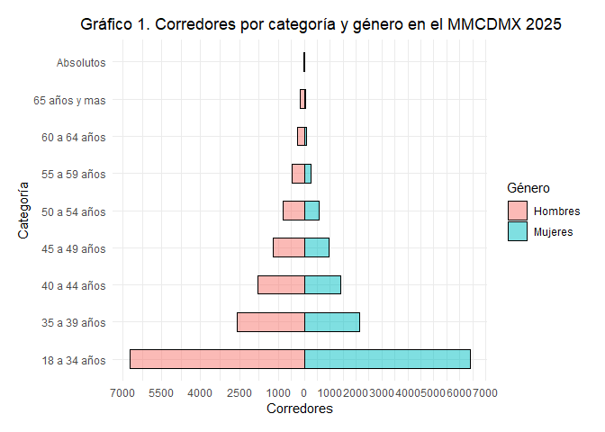
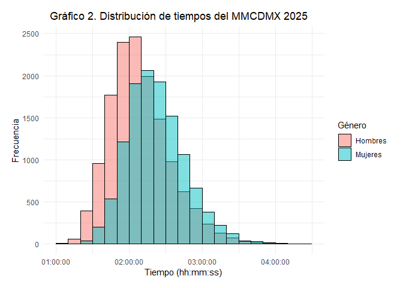
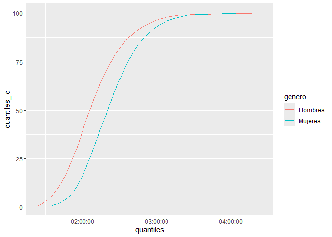
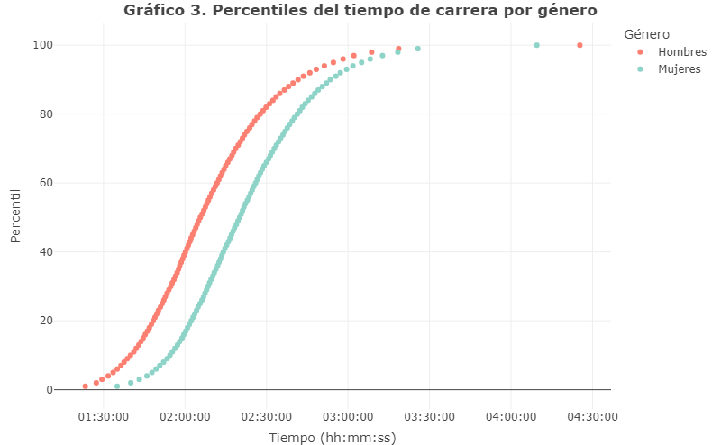

## OBTENCIÓN DE LOS DATOS

Para la obtención de todos los datos de los participantes del MMCDMX
2025 se realizó un web scraping dentro de la pagina oficial de
resultados de Márcate (<https://www.marcate.com.mx/resultados>), cabe
aclarar que todos los resultados son públicos. Dicha extracción se
realizó el día 15 de Julio de 2025, cualquier modificación o adición no
se verá reflejada en este análisis. Para cuidar información personal,
este análisis se centra en resultados agregados y no individuales.

## LIMPIEZA DE LOS DATOS

Primero cargamos los datos del web scraping. De aquí se obtiene que se
tiene un total de 29641 números de participantes.

``` r
# leer datos
data_MMCDMX205_intervalos <- read_csv("data_MMCDMX205_intervalos.csv", show_col_types = FALSE)
# ¿cuantos números?
total_folios <-  length(unique(data_MMCDMX205_intervalos$numero))
total_folios
```

    ## [1] 29641

Sin embargo, no todos estos números tienen participación en el medio
maratón, fueron un total de 2564 folios que no cuentan con tiempo
oficial y que se pueden catalogar como que no realizaron la carrera.
Quedando un total de 27077 participantes en la carrera.

``` r
# solo números con tiempo (personas que si iniciaron o tienen tiempo)
data_filter <- data_MMCDMX205_intervalos %>%
  filter(segundosGuntime  > 0 )

total_filtro <- length(unique(data_filter$numero))
total_noparticipa <- total_folios - total_filtro 
total_noparticipa 
```

    ## [1] 2564

Este tipo de carreras cuentan con puntos de control a lo largo del
recorrido, para el caso especifico de esta media maratón se colocaron un
total de 4 puntos de control en los kilómetros 5, 10, 15 y 20, dichos
puntos sirven como marcas intermedias que nos pueden apoyar al análisis
de la información.

Con el fin de contar con datos más limpios se ha decidido omitir del
análisis aquellos números que no cuenten con todos los registros de
estos puntos de control. La Tabla 1, muestra el total de registros por
punto de control, el cual va disminuyendo a medida que avanza los
kilómetros, llegando hasta un 2% de todos los participantes que no
cuentan con registro en el último punto de control.

``` r
# tabla de los registors en cada punto de control 
total_inter <- as.data.frame(table(data_filter$Intermedios.nombre))
# ordenar
total_inter <- arrange(total_inter, -Freq)
# obtener porcentajes
total_inter$porc <- (total_inter$Freq/length(unique(data_filter$numero)))*100
# tabla 
knitr::kable(total_inter, col.names = c("Intermedio", "Total registros", "Porcentaje sobre el total"), 
             caption = "Tabla 1.Total de registros por punto de control") 
```

| Intermedio | Total registros | Porcentaje sobre el total |
|:-----------|----------------:|--------------------------:|
| 5K         |           26794 |                  98.95483 |
| 10K        |           26747 |                  98.78125 |
| 15K        |           26734 |                  98.73324 |
| 20K        |           26549 |                  98.05001 |

Tabla 1.Total de registros por punto de control

Una vez eliminando los 1114 participantes que no cuentan con sus
registros completos, tenemos un total de 25963 corredores.

``` r
# filtrar que tengan los 4 intervalos
data_filter <- data_filter %>%
  group_by(numero) %>%
  filter(sum(table(Intermedios.nombre)) == 4) 

total_sin4registros <- total_filtro - length(unique(data_filter$numero))
# no cuentan con sus registros completos
total_sin4registros 
```

    ## [1] 1114

``` r
total_filtro <- length(unique(data_filter$numero))
```

Continuando con la limpieza de datos, aunque con menos casos dentro de
la base, se han revisado que los tiempos intermedios sean crecientes,
esto quiere decir que el corredor pasó en el orden correcto los puntos
de control. Una vez eliminados los 3 números que presentan discrepancia
en este concepto se tiene un total de 25960 participantes.

``` r
# revisar que los intervalos sean crecientes
data_filter <- data_filter %>%
  group_by(numero) %>%
  filter(first(Intermedios.tiempo) < nth(Intermedios.tiempo, 2) & 
          nth(Intermedios.tiempo, 2) < nth(Intermedios.tiempo, 3) & 
          nth(Intermedios.tiempo, 3) < nth(Intermedios.tiempo, 4)) %>%
  ungroup()

# tiene discrepancia en sus puntos de control
total_noorden <- total_filtro - length(unique(data_filter$numero))
total_noorden
```

    ## [1] 3

``` r
total_filtro <- length(unique(data_filter$numero))
```

Finalmente, se realiza un análisis para encontrar posibles discrepancias
entre el tiempo total y los tiempos intermedios, todos los tiempos
intermedios deben ser menor al tiempo total.

``` r
# comparar intermedios con total (no deberían existir negativos)
data_filter$check_guntime <- as.numeric(data_filter$guntime- data_filter$Intermedios.tiempo)
data_filter$check_chiptime <-as.numeric(data_filter$tiempoChip - data_filter$Intermedios.tiempo) 

summary(data_filter$check_guntime)
```

    ##    Min. 1st Qu.  Median    Mean 3rd Qu.    Max. 
    ##   -2757    1192    3110    3322    5114   11857

``` r
summary(data_filter$check_chiptime )
```

    ##    Min. 1st Qu.  Median    Mean 3rd Qu.    Max. 
    ##     202    2958    4851    5131    6988   13815

Se observa una discrepancia entre los tiempos de “guntime”, dado que
vamos a hacer uso de esta variable, se filtran estos corredores con
errores en sus registros.

``` r
# borrar negativos (tiempo intermedio > tiempo total)
data_filter <- data_filter %>%
  group_by(numero) %>%
  filter(min(check_guntime) > 0) %>%
  ungroup()

# cuentan con intermedios > tiempo total
total_errortiempos <- total_filtro - length(unique(data_filter$numero))
total_errortiempos
```

    ## [1] 1

``` r
total_filtro <- length(unique(data_filter$numero))
```

## ANÁLISIS DE LOS DATOS

### Distribución población del MMCDMX 2025

Se obtiene el total de participares por categoría, estos son dividios
por edad y genero.

``` r
# agregar los datos por categoría (n)
data_resume_totales <- data_filter %>%
  distinct(numero, .keep_all = TRUE) %>%
  group_by(categoria) %>%
  summarise( n = n()) %>%
  ungroup()
```

Ajustes a los datos para obtener el gráfico requerido.

``` r
# manejamos los datos para gráfico
data_resume_totales$genero <- ifelse(grepl("Femenil", data_resume_totales$categoria) == TRUE, 
                                     "Mujeres", "Hombres")
data_resume_totales$cat <- strsplit(data_resume_totales$categoria, split = "Femenil|Varonil")

for (i in 3:18) {
 data_resume_totales$cat[i] <-  data_resume_totales$cat[[i]][2]
}

# borra espacios
data_resume_totales$cat <- sub("^\\s+|\\s+$", "", data_resume_totales$cat)
```

El Gráfico 1. muestra la distribución de corredores por genero y edad,
donde se observa que la categoría con más corredores en ambos géneros
fue de 18 a 34 años. Tanto en hombres como en mujeres se nota una
disminución en el número de corredores a medida que aumenta la edad de
la categoría.

``` r
# gráfico
ggplot(data_resume_totales, aes(x = cat, y = n, fill = genero)) +
  geom_col(data = subset(data_resume_totales, genero == "Hombres") %>% 
             mutate(n = -n), width = 0.5, alpha = 0.5, col = "black") +
  geom_col(data = subset(data_resume_totales, genero == "Mujeres"),
           width = 0.5, alpha = 0.5, col = "black") +
  labs( x = "Categoría", y = "Corredores", fill = "Género",
    title = "Gráfico 1. Corredores por categoría y género en el MMCDMX 2025") +
  coord_flip() +
  scale_y_continuous(
    breaks = c(seq(-7000, -1000, by = 1500), seq(0, 7000, by = 1000)),
    labels = c(seq(-7000, -1000, by = 1500) * -1, seq(0, 7000, by = 1000)) ) +
  theme_minimal() +
  theme(plot.title = element_text(hjust = 0.3),
    plot.margin = unit(c(.5, .5, .5, .5), "cm"))
```

<!-- -->

### Ritmos del MMCDMX 2025

Se obtiene el pace promedio de la carrera utilizando el tiempo real de
carrera del participante (nota: normalmente para esto se utiliza el
chiptime en lugar del guntime, pero en la base estos se encuentran
intercambiados, de acuerdo a previo análisis).

``` r
# Pace con base en chiptime aunque el termino está al revés
  # por eso se usa guntime
data_filter$segundos_chiptime <- as.numeric(data_filter$guntime)

# pace
data_filter$segundos_pace <- data_filter$segundos_chiptime/21.097
```

Se obtiene el pace para cada categoria y género.

``` r
# agregar los datos por categoría
data_resume <- data_filter %>%
  distinct(numero, .keep_all = TRUE) %>%
  group_by(categoria) %>%
  summarise(mean_pace = mean(segundos_pace),
            min_pace = min(segundos_pace), 
            max_pace = max(segundos_pace), 
             n = n()) %>%
  ungroup()

# redondear tiempos
data_resume[,2:4] <- round(data_resume[,2:4])

# para contrucción del pace
minutes <- data_resume[,2:4] %/% 60
seconds <- data_resume[,2:4] %% 60

#pace con formato mm:ss
for (i in 1:3) {
  data_resume[,1 + i] <-  sprintf("%d:%02d", minutes[,i], seconds[,i])  
}

# dividir por género
data_resume_fem <- data_resume[grep("Femenil", data_resume$categoria), ]
data_resume_var <- data_resume[grep("Varonil", data_resume$categoria), ]
data_resume_var <- data_resume_var[c(1:3, 9,4:8),]
```

La Tabla 2, muestra los ritmos promedios, mínimos y máximos por
categoría femenil, donde se observa que el mejor ritmo de todas las
mujeres fue de 3:27 min/km. En cuanto a los ritmos promedios, estos van
aumentando conforme la edad de la categoría, pasando de 6:40 min/km en
el grupo de 18 a 34 años a 7:24 min/km en el grupo de 65 años y más.

``` r
knitr::kable(data_resume_fem, col.names = c("Categoría", "Ritmo medio", "Ritmo mínimo",
                                        "Ritmo máximo", "Corredores"), 
             caption = "Tabla 2. Resumen de ritmos por categoría femenil") 
```

| Categoría                          | Ritmo medio | Ritmo mínimo | Ritmo máximo | Corredores |
|:-----------------------------------|:------------|:-------------|:-------------|-----------:|
| Absolutos Femenil                  | 3:42        | 3:27         | 3:53         |          5 |
| Libre Femenil 18 a 34 años         | 6:40        | 3:50         | 11:50        |       6415 |
| Máster Femenil 35 a 39 años        | 6:41        | 4:04         | 10:54        |       2145 |
| Veteranos Femenil 40 a 44 años     | 6:48        | 3:49         | 11:37        |       1421 |
| Veteranos II Femenil 45 a 49 años  | 6:54        | 4:18         | 11:19        |        964 |
| Veteranos III Femenil 50 a 54 años | 7:02        | 4:16         | 10:28        |        581 |
| Veteranos IV Femenil 55 a 59 años  | 7:18        | 4:36         | 11:11        |        266 |
| Veteranos V Femenil 60 a 64 años   | 7:18        | 4:17         | 11:42        |         95 |
| Veteranos VI Femenil 65 años y mas | 7:24        | 5:35         | 10:37        |         48 |

Tabla 2. Resumen de ritmos por categoría femenil

La Tabla 3, muestra los ritmos promedios, mínimos y máximos por
categoría varonil, donde se observa que el mejor ritmo de todos los
hombres fue de 3:00 min/km. En cuanto a los ritmos promedios, estos van
aumentando conforme la edad de la categoría, pasando de 6:01 min/km en
el grupo de 18 a 34 años a 6:50 min/km en el grupo de 65 años y más.

``` r
knitr::kable(data_resume_var, col.names = c("Categoría", "Ritmo medio", "Ritmo mínimo",
                                        "Ritmo máximo", "Corredores"), 
             caption = "Tabla 3. Resumen de ritmos por categoría varonil") 
```

| Categoría                          | Ritmo medio | Ritmo mínimo | Ritmo máximo | Corredores |
|:-----------------------------------|:------------|:-------------|:-------------|-----------:|
| Absolutos Varonil                  | 3:07        | 3:00         | 3:14         |          5 |
| Libre Varonil 18 a 34 años         | 6:01        | 3:18         | 11:19        |       6740 |
| Máster Varonil 35 a 39 años        | 6:02        | 3:17         | 12:35        |       2605 |
| Veteranos Varonil 40 a 44 años     | 6:07        | 3:15         | 11:31        |       1783 |
| Veteranos II Varonil 45 a 49 años  | 6:14        | 3:40         | 10:42        |       1192 |
| Veteranos III Varonil 50 a 54 años | 6:20        | 3:28         | 11:42        |        811 |
| Veteranos IV Varonil 55 a 59 años  | 6:29        | 3:48         | 10:13        |        458 |
| Veteranos V Varonil 60 a 64 años   | 6:31        | 3:57         | 10:01        |        258 |
| Veteranos VI Varonil 65 años y mas | 6:50        | 4:12         | 10:01        |        167 |

Tabla 3. Resumen de ritmos por categoría varonil

### Distribución de tiempos oficiales

``` r
data_tiempos <- data_filter %>%
  distinct(numero, .keep_all = TRUE)

data_tiempos$genero <- ifelse(grepl("Femenil", data_tiempos$categoria) == TRUE, 
                                     "Mujeres", "Hombres")
```

``` r
ggplot(data_tiempos) +
  geom_histogram(aes(x = guntime , fill = genero), 
                col = "black",  position = "identity", alpha = 0.5,
                breaks = seq(3600, 3600*4.5, by =600)) +
  labs(x = "Tiempo (hh:mm:ss)", y = "Frecuencia", fill = "Género",
       title = "Gráfico 2. Distribución de tiempos del MMCDMX 2025")+
  theme_minimal() +
  theme(plot.title = element_text(hjust = 0.3),
    plot.margin = unit(c(.5, .5, .5, .5), "cm"))
```

<!-- -->

``` r
data_quantil <- data_tiempos %>%
  group_by(genero) %>%
  summarise(quantiles = list(quantile(guntime, probs = seq(0.01,1,0.01)))) %>%
  unnest_longer(quantiles)

data_quantil$quantiles_id <- gsub("%", "",data_quantil$quantiles_id )
data_quantil$quantiles_id <- as.numeric(data_quantil$quantiles_id)

data_quantil$quantiles_secs <- as.POSIXct( as.numeric(data_quantil$quantiles),  origin = "1970-01-01", tz = "UTC")
```

``` r
ggplot(data_quantil) + 
  geom_line(aes(x = quantiles, y = quantiles_id, colour = genero)) 
```

<!-- -->

``` r
plot <- plot_ly( data_quantil, x = ~quantiles_secs,  y = ~quantiles_id,
  color = ~genero,
  type = 'scatter',
  mode = 'markers', colors = c("#fb8072", "#8dd3c7")) %>%
  layout(xaxis = list(
    title = "Tiempo (hh:mm:ss)", 
     tickformat = "%H:%M:%S" ))

htmlwidgets::saveWidget(plot, "html/plot.html")
```

[](html/plot.html)
