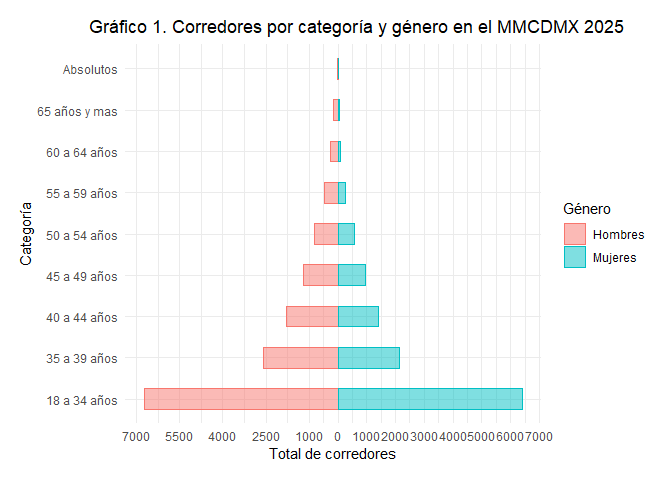
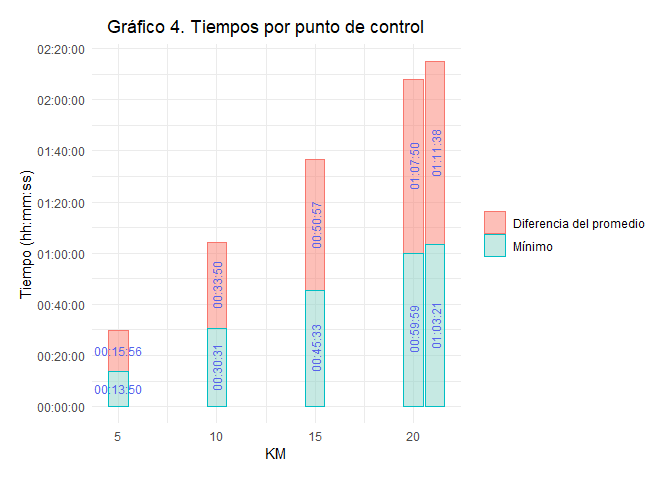

## OBTENCIÓN DE LOS DATOS

Para la obtención de todos los datos de los participantes del Medio
Maratón de la Ciudad de México 2025 (MMCDMX 2025) se realizó un web
scraping dentro de la pagina oficial de resultados de Márcate
(<https://www.marcate.com.mx/resultados>), cabe aclarar que todos los
resultados son públicos. Dicha extracción se realizó el día 15 de Julio
de 2025, cualquier modificación o adición posterior no se verá reflejada
en este análisis. Para cuidar información personal, este análisis se
centra en resultados agregados y no individuales.

## LIMPIEZA DE LOS DATOS

Se cargan los datos del web scraping. La base contiene registros para un
total de 29641 números de participantes, con un agregado de 24
variables.

``` r
# leer datos
data_MMCDMX205_intervalos <- read_csv("data_MMCDMX205_intervalos.csv", show_col_types = FALSE)
# ¿cuantos números?
total_folios <-  length(unique(data_MMCDMX205_intervalos$numero))
total_folios
```

    ## [1] 29641

``` r
names(data_MMCDMX205_intervalos)
```

    ##  [1] "nombre"                    "carreraId"                
    ##  [3] "carrera"                   "distancia"                
    ##  [5] "categoria"                 "rama"                     
    ##  [7] "posicion"                  "posicion_cuenta"          
    ##  [9] "numero"                    "equipo"                   
    ## [11] "estimado"                  "guntime"                  
    ## [13] "tiempoChip"                "pace"                     
    ## [15] "paso"                      "posicionRama"             
    ## [17] "posicionRama_cuantos"      "posicionCategoria"        
    ## [19] "posicionCategoria_cuantos" "Intermedios.nombre"       
    ## [21] "Intermedios.tiempo"        "segundosGuntime"          
    ## [23] "segundosFoto1"             "segundosFoto2"

Sin embargo, no todos estos números tienen participación en el medio
maratón, fueron un total de 2564 folios que no cuentan con tiempo
oficial y que se pueden catalogar como que no realizaron la carrera.
Quedando un total de 27077 participantes en la carrera.

``` r
# solo números con tiempo, personas que si iniciaron (cuentan con tienen tiempo)
data_filter <- data_MMCDMX205_intervalos %>%
  filter(segundosGuntime  > 0 )

total_filtro <- length(unique(data_filter$numero))
total_noparticipa <- total_folios - total_filtro 
total_noparticipa 
```

    ## [1] 2564

Es importante señalar que este tipo de carreras cuentan con puntos de
control a lo largo del recorrido, para el caso especifico de esta media
maratón se colocaron un total de 4 puntos de control en los kilómetros
5, 10, 15 y 20, dichos puntos sirven como marcas intermedias que nos
pueden apoyar al análisis de la información.

Con el fin de contar con datos más limpios se ha decidido omitir del
análisis aquellos números que no cuenten con todos los registros de
estos puntos de control. La Tabla 1, muestra el total de registros por
punto de control, el cual va disminuyendo a medida que avanza los
kilómetros de la carrera, llegando hasta un 2% de todos los
participantes que no cuentan con registro en el último punto de control.

``` r
# tabla de los registros en cada punto de control 
total_inter <- as.data.frame(table(data_filter$Intermedios.nombre))
# ordenar
total_inter <- arrange(total_inter, -Freq)
# obtener porcentajes
total_inter$porc <- (total_inter$Freq/length(unique(data_filter$numero)))*100
# tabla 
knitr::kable(total_inter, col.names = c("Intermedio", "Total registros", "Porcentaje sobre el total"), 
             caption = "Tabla 1.Total de registros por punto de control") 
```

| Intermedio | Total registros | Porcentaje sobre el total |
|:-----------|----------------:|--------------------------:|
| 5K         |           26794 |                  98.95483 |
| 10K        |           26747 |                  98.78125 |
| 15K        |           26734 |                  98.73324 |
| 20K        |           26549 |                  98.05001 |

Tabla 1.Total de registros por punto de control

Una vez eliminando los 1114 participantes que no cuentan con sus
registros completos, tenemos un total de 25963 corredores.

``` r
# filtrar que tengan los 4 intervalos
data_filter <- data_filter %>%
  group_by(numero) %>%
  filter(sum(table(Intermedios.nombre)) == 4) 

total_sin4registros <- total_filtro - length(unique(data_filter$numero))
# no cuentan con sus registros completos
total_sin4registros 
```

    ## [1] 1114

``` r
total_filtro <- length(unique(data_filter$numero))
```

Continuando con la limpieza de datos, aunque con menos casos dentro de
la base, se han revisado que los tiempos intermedios sean crecientes,
esto quiere decir que el corredor pasó en el orden correcto los puntos
de control. Una vez eliminados los números que presentan discrepancia,
solo son 3, se tiene un total de 25960 participantes.

``` r
# revisar que los intervalos sean crecientes
data_filter <- data_filter %>%
  group_by(numero) %>%
  filter(first(Intermedios.tiempo) < nth(Intermedios.tiempo, 2) & 
          nth(Intermedios.tiempo, 2) < nth(Intermedios.tiempo, 3) & 
          nth(Intermedios.tiempo, 3) < nth(Intermedios.tiempo, 4)) %>%
  ungroup()

# tiene discrepancia en sus puntos de control
total_noorden <- total_filtro - length(unique(data_filter$numero))
total_noorden
```

    ## [1] 3

``` r
total_filtro <- length(unique(data_filter$numero))
```

Finalmente, se realiza un análisis para encontrar posibles discrepancias
entre el tiempo total y los tiempos intermedios, todos los tiempos
intermedios deben ser menor al tiempo total.

``` r
# comparar intermedios con total (no deberían existir negativos)
data_filter$check_guntime <- as.numeric(data_filter$guntime- data_filter$Intermedios.tiempo)
data_filter$check_chiptime <-as.numeric(data_filter$tiempoChip - data_filter$Intermedios.tiempo) 

# check
summary(data_filter$check_guntime)
```

    ##    Min. 1st Qu.  Median    Mean 3rd Qu.    Max. 
    ##   -2757    1192    3110    3322    5114   11857

``` r
summary(data_filter$check_chiptime )
```

    ##    Min. 1st Qu.  Median    Mean 3rd Qu.    Max. 
    ##     202    2958    4851    5131    6988   13815

Se observa una discrepancia entre los tiempos de “guntime”, dado que se
va a hacer uso de esta variable, se filtran estos corredores con errores
en sus registros, aunque solo es 1 caso.

``` r
# borrar negativos (tiempo intermedio > tiempo total)
data_filter <- data_filter %>%
  group_by(numero) %>%
  filter(min(check_guntime) > 0) %>%
  ungroup()

# cuentan con intermedios > tiempo total
total_errortiempos <- total_filtro - length(unique(data_filter$numero))
total_errortiempos
```

    ## [1] 1

``` r
total_filtro <- length(unique(data_filter$numero))
```

Terminada la fase de limpieza de datos, la base final cuenta con un
total de 25959 números de participantes, con un total de 24 variables.

## ANÁLISIS DE LOS DATOS

### Distribución poblacional del MMCDMX 2025

Se obtiene el total de participares por categoría, estos son dividios
por edad y genero.

``` r
# agregar los datos por categoría (n)
data_resume_totales <- data_filter %>%
  distinct(numero, .keep_all = TRUE) %>%
  group_by(categoria) %>%
  summarise( n = n()) %>%
  ungroup()
```

Ajustes a los datos para obtener el gráfico requerido.

``` r
# manejamos los datos para gráfico
data_resume_totales$genero <- ifelse(grepl("Femenil", data_resume_totales$categoria) == TRUE, 
                                     "Mujeres", "Hombres")
data_resume_totales$cat <- strsplit(data_resume_totales$categoria, split = "Femenil|Varonil")

for (i in 3:18) {
 data_resume_totales$cat[i] <-  data_resume_totales$cat[[i]][2]
}

# borrar espacios
data_resume_totales$cat <- sub("^\\s+|\\s+$", "", data_resume_totales$cat)

# totales por género
totales_gen <- data_resume_totales %>%
  group_by(genero) %>%
  summarise(total = sum(n))
```

De todos los participantes de la carrera, se encuentra que el agregado
de mujeres dentro del MMCDMX 2025 fue de 11940, el resto, 14019, son
hombres.

El Gráfico 1. muestra la distribución de corredores por genero y edad,
donde se observa que la categoría con más corredores en ambos géneros
fue de 18 a 34 años. Tanto en mujeres como en hombres se aprecia una
disminución en el número de corredores a medida que aumenta la edad de
la categoría.

``` r
# gráfico 1
ggplot(data_resume_totales, aes(x = cat, y = n, fill = genero, col = genero)) +
  geom_col(data = subset(data_resume_totales, genero == "Hombres") %>% 
             mutate(n = -n), width = 0.5, alpha = 0.5, linewidth=0.5) +
  geom_col(data = subset(data_resume_totales, genero == "Mujeres"),
           width = 0.5, alpha = 0.5, linewidth=0.5) +
  labs( x = "Categoría", y = "Total de corredores", fill = "Género", col = "Género",
    title = "Gráfico 1. Corredores por categoría y género en el MMCDMX 2025") +
  coord_flip() +
  scale_y_continuous(
    breaks = c(seq(-7000, -1000, by = 1500), seq(0, 7000, by = 1000)),
    labels = c(seq(-7000, -1000, by = 1500) * -1, seq(0, 7000, by = 1000)) ) +
  theme_minimal() +
  theme(plot.title = element_text(hjust = 0.3),
    plot.margin = unit(c(.5, .5, .5, .5), "cm"))
```

<!-- -->

### Ritmos del MMCDMX 2025

Se obtiene el pace promedio de la carrera utilizando el tiempo real de
carrera del participante (nota: normalmente para esto se utiliza el
chiptime en lugar del guntime, pero en la base estos se encuentran
intercambiados, de acuerdo a previo análisis).

``` r
# Pace con base en chiptime aunque el termino está al revés
  # por eso se usa guntime
data_filter$segundos_chiptime <- as.numeric(data_filter$guntime)

# pace
data_filter$segundos_pace <- data_filter$segundos_chiptime/21.097
```

Se obtiene el pace para cada categoría y género.

``` r
# agregar los datos por categoría
data_resume <- data_filter %>%
  distinct(numero, .keep_all = TRUE) %>%
  group_by(categoria) %>%
  summarise(mean_pace = mean(segundos_pace),
            min_pace = min(segundos_pace), 
            max_pace = max(segundos_pace), 
             n = n()) %>%
  ungroup()

# redondear tiempos
data_resume[,2:4] <- round(data_resume[,2:4])

# para construcción del pace
minutes <- data_resume[,2:4] %/% 60
seconds <- data_resume[,2:4] %% 60

# pace con formato mm:ss
for (i in 1:3) {
  data_resume[,1 + i] <-  sprintf("%d:%02d", minutes[,i], seconds[,i])  
}

# dividir por género
data_resume_fem <- data_resume[grep("Femenil", data_resume$categoria), ]
data_resume_var <- data_resume[grep("Varonil", data_resume$categoria), ]
data_resume_var <- data_resume_var[c(1:3, 9,4:8),]
```

La Tabla 2, muestra los ritmos promedios, mínimos y máximos por
categoría femenil, donde se observa que el mejor ritmo de todas las
mujeres fue de 3:27 min/km. En cuanto a los ritmos promedios, estos van
aumentando conforme la edad de la categoría, pasando de 6:40 min/km en
el grupo de 18 a 34 años a 7:24 min/km en el grupo de 65 años y más.

``` r
knitr::kable(data_resume_fem, col.names = c("Categoría", "Ritmo medio", "Ritmo mínimo",
                                        "Ritmo máximo", "Corredores"), 
             caption = "Tabla 2. Resumen de ritmos por categoría femenil") 
```

| Categoría                          | Ritmo medio | Ritmo mínimo | Ritmo máximo | Corredores |
|:-----------------------------------|:------------|:-------------|:-------------|-----------:|
| Absolutos Femenil                  | 3:42        | 3:27         | 3:53         |          5 |
| Libre Femenil 18 a 34 años         | 6:40        | 3:50         | 11:50        |       6415 |
| Máster Femenil 35 a 39 años        | 6:41        | 4:04         | 10:54        |       2145 |
| Veteranos Femenil 40 a 44 años     | 6:48        | 3:49         | 11:37        |       1421 |
| Veteranos II Femenil 45 a 49 años  | 6:54        | 4:18         | 11:19        |        964 |
| Veteranos III Femenil 50 a 54 años | 7:02        | 4:16         | 10:28        |        581 |
| Veteranos IV Femenil 55 a 59 años  | 7:18        | 4:36         | 11:11        |        266 |
| Veteranos V Femenil 60 a 64 años   | 7:18        | 4:17         | 11:42        |         95 |
| Veteranos VI Femenil 65 años y mas | 7:24        | 5:35         | 10:37        |         48 |

Tabla 2. Resumen de ritmos por categoría femenil

La Tabla 3, muestra los ritmos promedios, mínimos y máximos por
categoría varonil, donde se observa que el mejor ritmo de todos los
hombres fue de 3:00 min/km. En cuanto a los ritmos promedios, estos van
aumentando conforme la edad de la categoría, pasando de 6:01 min/km en
el grupo de 18 a 34 años a 6:50 min/km en el grupo de 65 años y más.

``` r
knitr::kable(data_resume_var, col.names = c("Categoría", "Ritmo medio", "Ritmo mínimo",
                                        "Ritmo máximo", "Corredores"), 
             caption = "Tabla 3. Resumen de ritmos por categoría varonil") 
```

| Categoría                          | Ritmo medio | Ritmo mínimo | Ritmo máximo | Corredores |
|:-----------------------------------|:------------|:-------------|:-------------|-----------:|
| Absolutos Varonil                  | 3:07        | 3:00         | 3:14         |          5 |
| Libre Varonil 18 a 34 años         | 6:01        | 3:18         | 11:19        |       6740 |
| Máster Varonil 35 a 39 años        | 6:02        | 3:17         | 12:35        |       2605 |
| Veteranos Varonil 40 a 44 años     | 6:07        | 3:15         | 11:31        |       1783 |
| Veteranos II Varonil 45 a 49 años  | 6:14        | 3:40         | 10:42        |       1192 |
| Veteranos III Varonil 50 a 54 años | 6:20        | 3:28         | 11:42        |        811 |
| Veteranos IV Varonil 55 a 59 años  | 6:29        | 3:48         | 10:13        |        458 |
| Veteranos V Varonil 60 a 64 años   | 6:31        | 3:57         | 10:01        |        258 |
| Veteranos VI Varonil 65 años y mas | 6:50        | 4:12         | 10:01        |        167 |

Tabla 3. Resumen de ritmos por categoría varonil

### Distribución de tiempos oficiales

Se obtiene la base con los registros de tiempo de carrera y se
identifica el género del corredor.

``` r
# registros únicos por corredor
data_tiempos <- data_filter %>%
  distinct(numero, .keep_all = TRUE)

data_tiempos$genero <- ifelse(grepl("Femenil", data_tiempos$categoria) == TRUE, 
                                     "Mujeres", "Hombres")

# estadísticos del tiempo de carrera
medias<- data_tiempos %>% 
  group_by(genero) %>%
  summarise(tiempo_media = mean(guntime), 
            tiempo_mediana = median(guntime))
# para labels
medias$tiempo_media_lab <-  as.character(hms::as_hms(round(medias$tiempo_media)))
medias$tiempo_mediana_lab <-  as.character(hms::as_hms(round(medias$tiempo_mediana)))
```

El Gráfico 2, muestra la distribución de los tiempos de carrera por
género, se observa que la distribución para los hombres cuenta con
menores tiempos, quienes en promedio terminaron el medio maratón en
02H:08M:44S, el tiempo medio de carrera de las mujeres fue 02H:22M:18S.

``` r
# gráfico 2
ggplot(data_tiempos) +
  geom_histogram(aes(x = guntime, fill = genero, col= genero), 
                 position = "identity", alpha = 0.5,
                 breaks = seq(3600, 3600*4.5, by = 600),
                 linewidth=0.5) +  
  geom_vline(data = medias, 
             aes(xintercept = tiempo_media,col= genero), 
             linetype="dashed", linewidth=1.2, show.legend = F) +
  geom_text(data = medias, aes(x = 11500, y = c(2400,2200)), col = c("#fb8072", "#8dd3c7"),
             label = paste("Media ", medias$genero, ":", medias$tiempo_media_lab, sep = ""),
            size = 3.5) +
  scale_color_manual( values = c("Hombres" = "#fb8072", "Mujeres" = "#8dd3c7")) +
  scale_fill_manual(values = c("Hombres" = "#fb8072", "Mujeres" = "#8dd3c7")) +
  labs(x = "Tiempo (hh:mm:ss)", y = "Frecuencia", col= "Género", fill = "Género",
       title = "Gráfico 2. Distribución de tiempos del MMCDMX 2025")+
  theme_minimal() +
  theme(plot.title = element_text(hjust = 0.3),
        plot.margin = unit(c(.5, .5, .5, .5), "cm"))
```

<!-- --> Para un
análisis más especifico de la distribución de tiempos podemos obtener
los percentiles por género.

``` r
# percentiles 
data_quantil <- data_tiempos %>%
  group_by(genero) %>%
  summarise(quantiles = list(quantile(guntime, probs = seq(0.01,1,0.01)))) %>%
  unnest_longer(quantiles)

# ajustes en variables
data_quantil$quantiles_id <- gsub("%", "",data_quantil$quantiles_id )
data_quantil$quantiles_id <- as.numeric(data_quantil$quantiles_id)
data_quantil$quantiles_secs <- as.POSIXct( as.numeric(data_quantil$quantiles), 
                                           origin = "1970-01-01", tz = "UTC")
```

El Gráfico 3 (el cual se puede revisar de manera interactiva), muestra
los percentiles de los tiempos de carrera por género, se observa que un
40% de los hombres corrió por debajo de 02H:00M:10S, muy cerca a lo que
se conoce como sub-2 horas en el medio maratón. El 20% de las mujeres
obtuvieron tiempos menores a 02H:00M:18S.

La herramienta del Gráfico 3, en su versión interactiva, puede ser útil
para cualquier persona que desee conocer cuál fue, o cuál sería, su
rendimiento relativo dentro de su género, únicamente conociendo el
tiempo de carrera para el medio maratón.

``` r
# gráfico 3
plot <- plot_ly( data_quantil, x = ~quantiles_secs,  y = ~quantiles_id,
  color = ~genero,
  type = 'scatter',
  mode = 'markers', colors = c("#fb8072", "#8dd3c7")) %>%
  layout(title = list(text = " <b> Gráfico 3. Percentiles del tiempo de carrera por género <b>",
                      y = 0.99, x = 0.5 ),
         xaxis = list(title = "Tiempo (hh:mm:ss)",  tickformat = "%H:%M:%S" ), 
         yaxis = list(title = "Percentil"), 
        legend = list(title=list(text='Género')))

htmlwidgets::saveWidget(plot, "html/plot.html", 
                        title = "G3. Percentiles tiempos MMCDMX 2025")
#plot
```

<iframe src="https://joelcae.github.io/analisis-mmcdmx2025/html/plot.html" width="100%" height="450"></iframe>

### Evolución de carrera

Finalmente, se puede conocer los tiempos promedio para los puntos de
control y de meta del MMCDMX 2025.

``` r
# datos para los puntos de control
data_inter <- data_filter %>%
  group_by(Intermedios.nombre) %>%
  summarise(t_min = min(Intermedios.tiempo), 
            t_max = max(Intermedios.tiempo),
            t_mean = mean(Intermedios.tiempo)) %>%
  ungroup()

# agregar datos de meta 
data_inter <- rbind(data_inter, c(21.1, min(data_tiempos$guntime), 
                    max(data_tiempos$guntime), mean(data_tiempos$guntime)))

# corregir algunas variables 
data_inter$Intermedios.nombre[4:5] <- c("05K", "21.1K")
data_inter$km <- as.numeric(gsub("K", "", data_inter$Intermedios.nombre)) 

# ordenar datos
data_inter <- data_inter %>%
  arrange(Intermedios.nombre) 

# datos para gráfico
data_inter$dif <- data_inter$t_mean - data_inter$t_min
data_inter$t_min <- hms::as_hms(round(data_inter$t_min))
data_inter$dif <- hms::as_hms(round(data_inter$dif))

# data par gráfico
data_long <- data_inter %>%
  pivot_longer(cols = c( dif,t_min), names_to = "tipo", 
               values_to = "tiempo")  %>%
  mutate(tipo = recode(tipo, dif = "Diferencia del promedio" ,
                       t_min = "Mínimo"))
```

El Gráfico 4, muestra el tiempo mínimo obtenido en cada parcial, así
como la diferencia en tiempo que a una persona en promedio le toma
llegar a ese mismo punto de control, mientras que el KM 5 la persona más
rápida lo pasa en 13M:50S, una persona promedio lo realiza en 29M:46S,
esto es una diferencia de 15M:56S.

Estos datos resultan en que, el tiempo mínimo de carrera en el MMCDMX
2025 fue de 01H:03M:21S. Para la persona promedio el tiempo de carrera
promedio fue de 02H:14M:59S, esto es, una diferencia de 01H:11M:38S.

``` r
# gráfico 4
ggplot(data_long, aes(x = km, y = tiempo, fill = tipo, col = tipo)) + 
  geom_col(alpha = 0.5) +
  geom_text(
    aes(label = hms::as_hms(tiempo)),
    position = position_stack(vjust = 0.5),
    size = 3.2, col= "#5564eb",
    angle = c(0,0,rep(90,8)), show.legend = F
  ) +
  scale_fill_manual(values = c("Diferencia del promedio" = "#fb8072", "Mínimo" = "#8dd3c7")) +
  scale_y_continuous(breaks = hms::as_hms(seq(0,3600*2.5, 1200))) +
  labs(x = "KM", y = "Tiempo (hh:mm:ss)",
       title = "Gráfico 4. Tiempos por punto de control",
       fill = NULL, col = NULL) +
  theme_minimal() +
  theme(plot.title = element_text(hjust = 0.3),
        plot.margin = unit(c(.5, .5, .5, .5), "cm"))
```

<!-- -->


